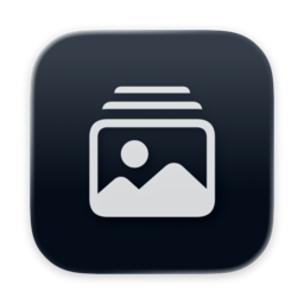

<p align="center">
  
</p>

<h1 align="center">RealExporter</h1>

<p align="center">
  A macOS app to export and convert your BeReal data into various formats.
</p>

<p align="center">
  <a href="https://github.com/jorisnoo/RealExporter/releases/latest">Download</a>
</p>

---

<p align="center">
  
  <br><br>
  
</p>

## Requirements

- macOS 14.0 (Sonoma) or later

## Installation

### Download

Download the latest release from the [Releases](https://github.com/jorisnoo/RealExporter/releases/latest) page.

### Build from Source

```bash
git clone https://github.com/jorisnoo/RealExporter.git
cd RealExporter
open RealExporter.xcodeproj
```

Build and run with Xcode 16+.

## How to Get Your BeReal Data

1. Open the **BeReal** app
2. Tap your **Profile** (top right)
3. Tap **Settings** (gear icon)
4. Tap **Help** > **Contact Us** > **Report a Problem** > **Other**
5. Tap **Still Need Help?** > **Select Topic**
6. Select **"I'd like to request a copy of my data"**
7. In the message box, paste the following:

> Hello,
>
> I am exercising my right under Article 15 of the GDPR to request a copy of all personal data you hold about me.
>
> Please provide this data in a portable format (e.g., JSON/ZIP) within the 45-day legal timeframe.
>
> Thank you.

BeReal must respond within **45 days**. You'll receive a ZIP file containing your photos and metadata — that's the file you load into RealExporter.
